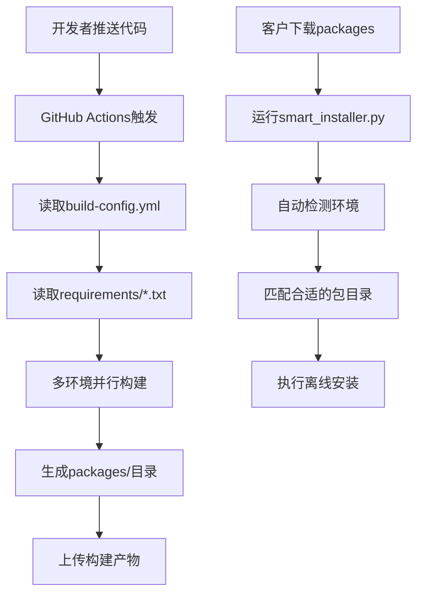

# python-offline-packages 项目结构

```
python-offline-packages/
├── .github/
│   └── workflows/
│       └── build-packages.yml              # GitHub Actions构建配置
├── config/
│   └── build-config.yml                    # 构建配置文件
├── scripts/
│   └── smart_installer.py                  # 智能安装脚本
├── packages/                               # 构建产物目录（自动生成）
│   ├── packages-ubuntu-latest-py38-x64/
│   ├── packages-ubuntu-latest-py39-x64/
│   ├── packages-windows-latest-py38-x64/
│   ├── packages-windows-latest-py39-x64/
│   └── ...
├── requirements/                           # 不同场景的需求文件
│   ├── scientific.txt                      # 科学计算
│   ├── machine-learning.txt                # 机器学习
│   ├── data-analysis.txt                   # 数据分析
│   └── deep-learning.txt                   # 深度学习
├── docs/                                   # 文档
│   ├── README.md                           # 主说明文档
│   ├── installation-guide.md               # 安装指南
│   └── troubleshooting.md                  # 故障排除
├── examples/                               # 使用示例
│   ├── basic_usage.py                      # 基本用法示例
│   └── verify_installation.py              # 安装验证脚本
├── .gitignore                              # Git忽略文件
├── README.md                               # 项目主README
├── requirements.txt                        # 默认包列表
└── LICENSE                                 # 开源许可证
```

## 各文件的作用和关系

### 1. GitHub Actions配置 (`.github/workflows/build-packages.yml`)
- **作用**: 自动化构建不同环境的离线包
- **触发**: 代码推送、手动触发、定时构建
- **读取**: `config/build-config.yml` 和 `requirements/*.txt`
- **输出**: 在 `packages/` 目录生成各环境的离线包

### 2. 构建配置文件 (`config/build-config.yml`)
- **作用**: 定义需要支持的环境和包组合
- **被读取**: GitHub Actions工作流
- **配置**: 不同场景的包列表、Python版本、平台等

### 3. 智能安装脚本 (`scripts/smart_installer.py`)
- **作用**: 在客户端自动检测环境并安装合适的包
- **使用**: 客户下载包后使用此脚本安装
- **功能**: 环境检测、包匹配、交互式安装

## 工作流程图

